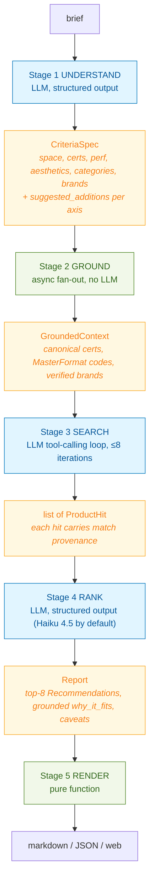
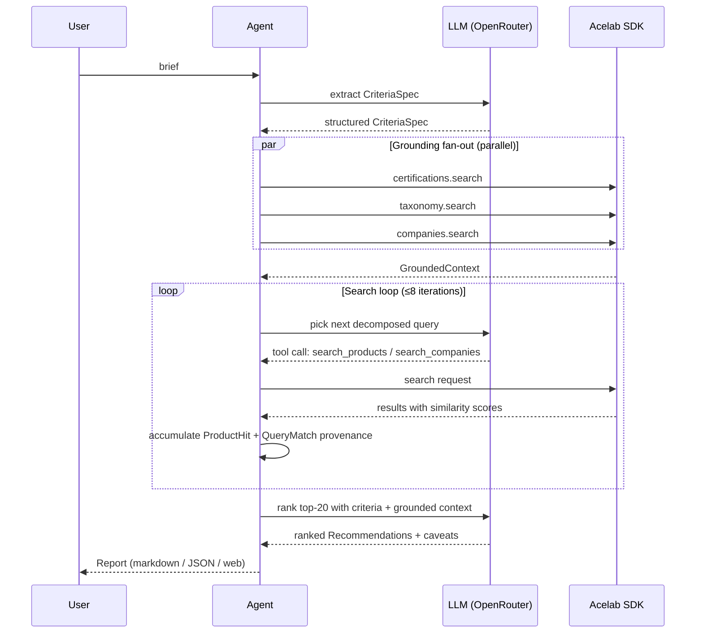

# Material Recommendation Agent

An AI agent that turns a free-text architect brief into ranked, grounded material recommendations against the Acelab catalog. Ships as a CLI (the core deliverable) with an optional React web UI layered on top.

## Brief (the take-home prompt)

> Build an agent that takes a natural language description of a project or space and returns ranked material recommendations with reasoning.
>
> **Example input:** "High-traffic hospital corridor that needs to meet infection control standards, LEED Silver minimum, and a calming aesthetic. Budget is mid-range."
>
> The agent should (1) analyze the request and identify what to search for, (2) make multiple, targeted calls to the Acelab SDK, and (3) synthesize results into ranked recommendations that explain *why* each product fits. The key differentiator is **multi-step reasoning**: decompose, search across multiple dimensions, cross-reference, and synthesize.

The full original prompt is preserved in git history (`6ce1480 chore: take-home repo as provided`).

## Quickstart

Prereqs: Python 3.12+, [uv](https://docs.astral.sh/uv/). Node 20+ only if you want to try the optional web UI.

```bash
# 1. Create .env with the three required keys (see .env.example)
cp .env.example .env
#    Then fill in: OPENROUTER_API_KEY, ACELAB_API_KEY, ACELAB_BASE_URL

# 2. Install
uv sync

# 3. Run the CLI
uv run python -m src.cli "High-traffic hospital corridor that needs to meet infection control standards, LEED Silver minimum, and a calming aesthetic. Budget is mid-range."
```

Output is markdown by default. Pass `--json` to dump the full structured `Report`:

```bash
uv run python -m src.cli "..." --json > report.json
```

Stage progress streams to stderr while results go to stdout, so `--json` stays clean for piping.

The optional `MODEL` env var overrides the default LLM (`anthropic/claude-sonnet-4.6`) for any OpenRouter-supported model. `RANK_MODEL` overrides Stage 4 specifically (default `anthropic/claude-haiku-4.5` for speed).

### Optional: web UI

A React web UI lives in `web/`. It's an addition to the CLI core, not the rubric-relevant deliverable, but it demonstrates the stage-level API by letting the user edit the agent's interpretation between stages.

```bash
# Terminal 1
uv run uvicorn src.api:app --reload    # FastAPI on :8000

# Terminal 2
cd web && npm install && npm run dev   # Vite on :5173
```

Then open http://localhost:5173. Vite proxies `/api/*` to the backend so no CORS setup is needed.

## Approach

A **4-stage hybrid pipeline**: a deterministic shell around an autonomous LLM tool-calling loop. Pure tool-calling skips grounding and rambles; a pure pipeline doesn't show real reasoning. The hybrid gets both: structured checkpoints for trust and reproducibility, autonomous decomposition where it actually matters.



**Stage 1 Understand.** A single structured-output LLM call parses the brief into a `CriteriaSpec`: space type, traffic level, budget tier, plus arrays for performance constraints, certifications required, aesthetic qualities, material categories, and branded preferences. Jargon (`IIC > 50`, `ASTM E84 Class A`) is preserved verbatim so Stage 2 can canonicalize it; silently dropping acronyms is the failure mode here. The same call also emits `suggested_additions` per axis (the web UI surfaces these as unchecked checkboxes).

**Stage 2 Ground.** Deterministic parallel fan-out (no LLM): each criterion is looked up against the appropriate Acelab reference endpoint via `asyncio.gather`. Cert phrases hit `certifications.search`, categories hit `taxonomy.search` (yielding MasterFormat codes like `09 65 16`), brands hit `companies.search` with a name-substring sanity check (the embedding endpoint will happily return `"Object Carpet"` for `"Interface"`). Empirical similarity thresholds derived from `examples/probe.py` keep noisy near-misses from contaminating Stage 3's prompt.

**Stage 3 Search.** An autonomous LLM tool-calling loop (≤8 iterations, ~12 calls) with three tools: `search_products`, `search_companies`, and `finish_searches`. The system prompt seeds with the `CriteriaSpec` plus `GroundedContext` and instructs decomposition along `{category × use-case × constraint}` axes. **Every** `search_products` call must carry an `axis_label` argument naming which `CriteriaSpec` axis the query derives from. That axis label is what gives every product hit its provenance trail (which queries surfaced it, at what score, for what reason). When the same product is hit by multiple queries, the entries accumulate. Stage 4 reasons over that provenance.

**Stage 4 Rank & Explain.** A single structured-output LLM call takes the `CriteriaSpec` plus `GroundedContext` plus the top-20 deduplicated `ProductHit`s and emits ranked `Recommendation`s. The prompt is the load-bearing hallucination guard: the LLM cites matched axes and scores from the provenance data, never claims certifications, materials, or specs the SDK didn't return. Defaults to Haiku 4.5 (~15s) since the work is structured-output rather than reasoning; Sonnet handles Stages 1 and 3 where planning matters more. A baseline `caveats[]` list is auto-derived from the brief so the architect always sees what to verify off-platform.

## Key design decisions

### Hybrid pipeline over pure tool-calling

Pure tool-calling lets the model wander and skips grounding. A pure pipeline doesn't demonstrate the multi-step reasoning the rubric grades. Bookending one autonomous loop (Stage 3) with three deterministic stages gets both: the structured stages keep the run reproducible and explainable, while Stage 3 still demonstrates real decomposition. The stage boundaries are also where the web UI inserts user edits cheaply.

### Match-provenance grounding for `why_it_fits`

The `ProductSearchResult` only exposes `(name, supplier, status, similarity_score)`. There is no `products.get()`, no per-product attribute API, no certification list per product. Any `why_it_fits` text that says "GREENGUARD Gold certified" or "low-VOC" is therefore a **hallucination**: the model has no source for that claim.

The recommendation reasoning is grounded **only** in:

1. Which decomposed queries surfaced the product, with their similarity scores.
2. The `CriteriaSpec` axes those queries derived from (the `axis_label` from Stage 3).
3. The product's `market_status` from the catalog (real values are `"Current Product"` or `"Recently Updated"`, a freshness marker; not a quality or compliance signal). Validated by `examples/probe_market_status.py`.
4. Taxonomy classification of the product's apparent category.

Every `Recommendation` ships with a `caveats[]` list that explicitly enumerates what the architect must verify on the manufacturer spec sheet. Stage 4's system prompt forbids attribute claims and includes negative examples ("not GREENGUARD Gold certified", etc.). Honesty over impressiveness.

**Advisory fields, not filters.** Three single-value `CriteriaSpec` fields (`space_type`, `traffic_level`, `budget_tier`) have no matching catalog attribute on the SDK side. There is no price field, no traffic rating, no space-type filter exposed by `client.search`. These signals surface in the Stage 3 and Stage 4 prompts as context so the LLM can bias query phrasing or break ties, but they never reach a deterministic filter and the agent cannot verify any returned product actually satisfies them. `budget_tier` is the leakiest of the three: a brief mentioning "luxury" produces `budget_tier: "luxury"`, yet nothing downstream can confirm price tier. Treat them as UI display, not constraint enforcement.

### No web-search models for v1

OpenRouter `:online` and Perplexity sonar variants would let the model verify cert claims via web search. Considered and rejected for v1:

- Cert details live in **PDF spec sheets**, not HTML. Web search lands on marketing pages and misses what we'd want.
- Latency cost: 5 to 15 seconds per call, multiplied across the top N picks, on top of the ~20s baseline.
- The rubric grades how well we use the **Acelab SDK**; bolting on external sources risks looking like we're routing around the actual challenge.

Kept as a stretch flag (`--verify-top-3`), not a v1 dependency.

### Stage-level API plus event stream

Each stage is a plain typed async function:

```python
async def understand(brief) -> CriteriaSpec
async def ground(criteria) -> GroundedContext
async def search(criteria, grounded, on_event=None) -> list[ProductHit]
async def rank(criteria, grounded, hits) -> Report
```

`run_agent()` is a thin wrapper that chains them and emits `AgentEvent`s. The CLI uses the wrapper. The web UI calls each stage individually and interposes user edits between them (Stage 1 keyword chips, Stage 2 cert/taxonomy/brand confirmations), consuming the same event stream for a live progress sidebar. The agent layer was unchanged when the web UI was added.

### Honesty over impressiveness

Every recommendation comes with verification caveats. The Stage 4 prompt explicitly forbids attribute claims it can't ground in the API response. A recommendation that admits "this product surfaced for queries derived from your *infection-control* and *flooring* axes; verify GREENGUARD Gold and antimicrobial coating on the manufacturer spec sheet" is more useful to an architect than one that confidently invents certifications.

### Top 8 by default

Eight recommendations is the working sweet spot: more than ten causes scrolling fatigue, fewer than five feels under-served. Stage 4's prompt enforces "return exactly N unless the candidate pool literally has fewer than N viable products" with the candidate-pool stats injected into the user payload so the LLM can mechanically check whether under-returning is permitted.

## Repository tour

| Path | Purpose |
|---|---|
| `acelab/` | Vendor SDK (do not modify). |
| `src/schemas.py` | Pydantic types: the only data structures that flow between stages. |
| `src/llm.py` | OpenRouter client, structured-output and tool-calling helpers. |
| `src/stages/understand.py` | Stage 1: brief to `CriteriaSpec` (1 LLM call). |
| `src/stages/ground.py` | Stage 2: parallel fan-out to `certifications`, `taxonomy`, `companies` (no LLM). |
| `src/stages/search.py` | Stage 3: autonomous tool-calling loop with provenance tracking. |
| `src/stages/rank.py` | Stage 4: ranked recommendations with grounded `why_it_fits`. |
| `src/agent.py` | Stage-level API + `run_agent()` convenience wrapper + event emission. |
| `src/render.py` | `Report` to markdown (deterministic, pure function). |
| `src/cli.py` | `python -m src.cli "<brief>" [--json]` entry point. |
| `src/api.py` | Optional FastAPI HTTP layer with SSE for the web UI. Mirrors the stage-level API. |
| `web/` | Optional React + TypeScript + Vite + Tailwind v4 web UI. Calls the FastAPI backend; proxies `/api` during dev. |
| `tests/` | Validation set (10 `BriefCase`s spanning content + input-quality axes), per-stage unit tests + FastAPI endpoint tests with hand-written mocks (`pytest tests/test_stages.py tests/test_api.py`, runs in under 1s on every save), and live-API e2e tests behind the `pytest -m e2e` marker including a hallucination audit. |
| `examples/basic_usage.py` | Original Acelab SDK smoke test (verifies env wiring). |
| `examples/probe.py`, `probe_companies.py` | Diagnostic SDK probes that informed the architecture (Stage 2 thresholds, decision not to enrich with `materials.notes`, brand-search name-substring sanity check). |

## Pipeline at a glance



## What I would improve with more time

- **`--verify-top-3` flag** using `:online` web search to verify cert claims on the top 3 picks only. Kept off the v1 critical path so latency and rubric framing stay clean, but it's the natural next add-on for an architect who wants extra confidence before specifying.
- **Persistent run history** in the web UI. Right now each search starts from a clean slate; storing recent runs in localStorage (or behind a SQLite cache on the backend) would let architects compare alternatives or revisit a run.
- **LLM-judge cert canonicalization.** Today's threshold-based grounding occasionally lets semantically related but factually different certs through (e.g. "ASTM E84 Class A" resolves to "E108-20a (Class A)", which is a different test). A second-pass LLM judge with a clear "is X the same standard as Y?" prompt would catch these.
- **Cached SDK responses for deterministic e2e tests.** The 21-test `pytest -m e2e` suite currently hits live APIs and burns LLM credits per run. Recording the SDK responses per `BriefCase` once (and the LLM responses behind a deterministic seed) would make hallucination audits and prompt-regression checks CI-friendly.
- **Sharper Stage 1 axis taxonomy.** "no PVC" is currently tagged as a performance constraint when it's arguably a material exclusion. A separate `material_exclusions[]` axis (or a tighter prompt with negative examples) would give Stage 3 a cleaner signal to filter against rather than search for.
